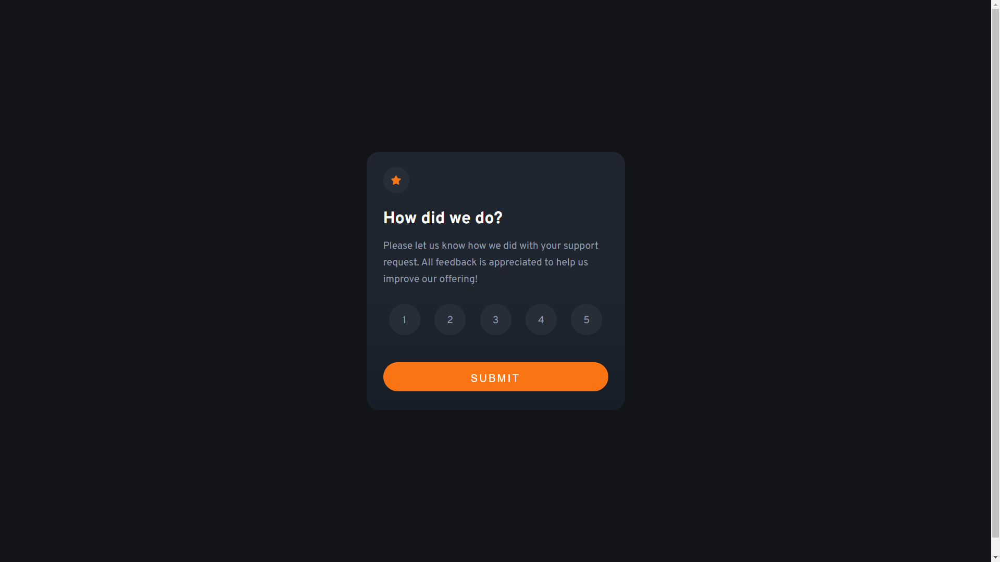
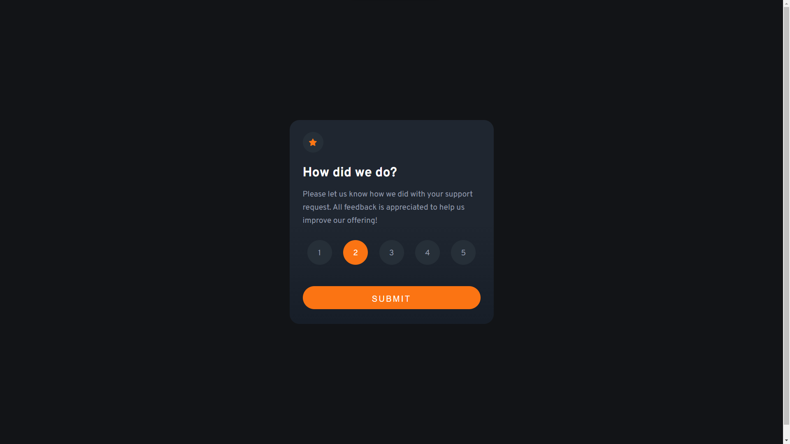
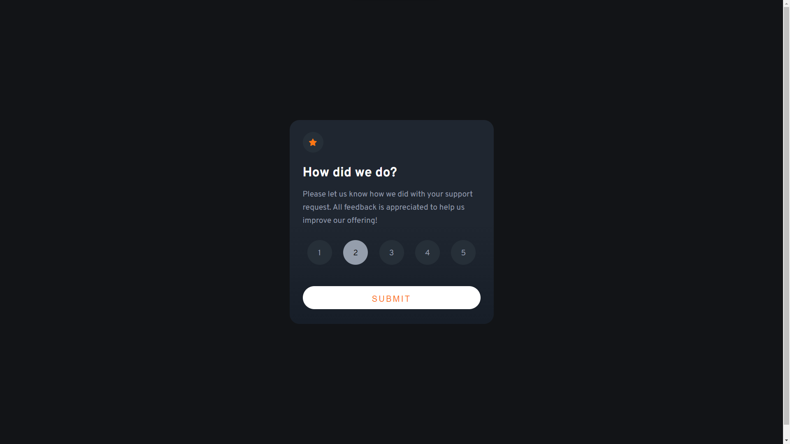
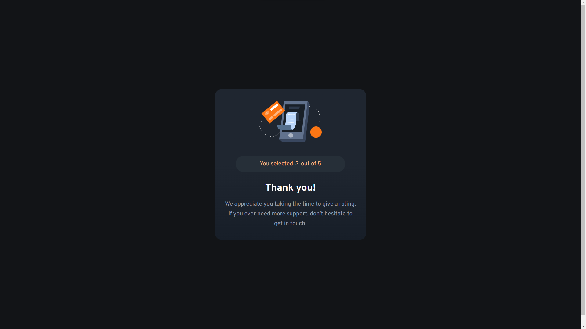

**The challenge** 🏅

Users should be able to:

- View the optimal layout for the app depending on their device's screen size
- See hover states for all interactive elements on the page
- Select and submit a number rating
- See the "Thank you" card state after submitting a rating
- 
**Screenshots** 📸

**Inactive state**

**Hovered score button**

**Focused score button and hovered submit button**

**Second card display**

**Built with** 🛠
-   Semantic HTML5 markup
-   CSS custom properties
-   Flexbox
-   CSS Grid
-   jQuery

**What I learned** 📖
- I have gained confidence in JavaScript language and jQuery library
- Using GitHub (initiating new repository, making commits, create and use new branches)

**Continued development** 👩🏼‍🎓
- learn more developed frameworks like React / Angular
- explore ways to make my web applications more inclusive and user-friendly, ensuring they adhere to accessibility standards and cater to a diverse audience
